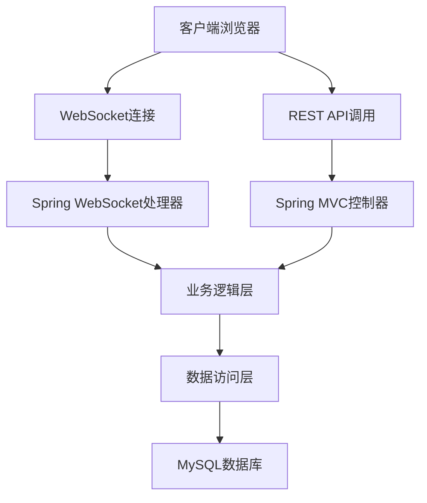

# ChatRoom 网络聊天室

一个基于Spring Boot和WebSocket的实时网络聊天室应用，支持一对一私聊、群组聊天、用户认证和离线消息等功能。

## 功能特性

- [x] 用户注册与登录（JWT Token认证）
- [x] 实时一对一私聊
- [x] 实时群组聊天
- [x] 在线用户状态显示
- [x] 离线消息存储与推送
- [x] 消息历史记录查看
- [x] 消息状态跟踪（已发送、已送达、已读）
- [x] WebSocket实时通信
- [x] RESTful API接口
- [x] 群组创建和管理

## 技术栈

### 后端技术
- **Spring Boot 3.2.5** - 核心框架
- **Spring Security** - 安全认证
- **Spring Data JPA** - 数据持久化
- **Spring WebSocket** - 实时通信
- **MySQL/H2** - 数据库
- **JWT** - Token认证
- **Maven** - 项目构建工具

### 前端技术
- **HTML/CSS/JavaScript** - 前端界面
- **原生WebSocket** - 客户端实时通信

## 系统架构



## 项目结构

```
src/
├── main/
│   ├── java/
│   │   └── com/example/chatroom/
│   │       ├── ChatRoomApplication.java     # 应用启动类
│   │       ├── config/                     # 配置类
│   │       ├── controller/                 # REST控制器
│   │       ├── dto/                        # 数据传输对象
│   │       ├── entity/                     # 实体类
│   │       ├── exception/                  # 异常处理
│   │       ├── repository/                 # 数据访问接口
│   │       ├── security/                   # 安全配置
│   │       ├── service/                    # 业务逻辑
│   │       ├── task/                       # 定时任务
│   │       └── websocket/                  # WebSocket相关
│   └── resources/
│       ├── static/                         # 静态资源文件
│       ├── application.yml                 # 配置文件
└── test/                                   # 测试代码
```

## 环境要求

- **Java 17** 或更高版本
- **Maven 3.6+**
- **MySQL 8.0** 或 **H2数据库**（用于测试）

## 快速开始

### 1. 克隆项目

```bash
git clone <repository-url>
cd ChatRoom
```

### 2. 数据库配置

#### 使用H2内存数据库（推荐用于开发测试）
项目默认配置使用H2内存数据库，无需额外配置即可运行。

#### 使用MySQL数据库
1. 创建MySQL数据库：
   ```sql
   CREATE DATABASE chatroom;
   ```

2. 创建数据库用户并授权：
   ```sql
   CREATE USER 'chatroom_user'@'localhost' IDENTIFIED BY 'chatroom_pass';
   GRANT ALL PRIVILEGES ON chatroom.* TO 'chatroom_user'@'localhost';
   FLUSH PRIVILEGES;
   ```

3. 修改`src/main/resources/application.yml`中的数据库配置：
   ```yaml
   spring:
     datasource:
       url: jdbc:mysql://localhost:3306/chatroom?createDatabaseIfNotExist=true&useSSL=false&serverTimezone=UTC&allowPublicKeyRetrieval=true
       username: chatroom_user
       password: chatroom_pass
   ```

### 3. 构建和运行

```bash
# 清理并编译项目
mvn clean compile

# 运行应用
mvn spring-boot:run
```

或者打包后运行：

```bash
# 打包项目
mvn clean package

# 运行jar包
java -jar target/ChatRoom-1.0.0.jar
```

### 4. 访问应用

打开浏览器访问：http://localhost:8080

## API文档

### 认证相关
- `POST /api/auth/register` - 用户注册
- `POST /api/auth/login` - 用户登录

### 用户相关
- `GET /api/users/me` - 获取当前用户信息
- `GET /api/users/{id}` - 根据ID获取用户信息
- `GET /api/users/username/{username}` - 根据用户名获取用户信息
- `GET /api/users/online` - 获取在线用户列表
- `GET /api/users/search?keyword=xxx` - 搜索用户

### 群组相关
- `POST /api/groups` - 创建群组
- `GET /api/groups/{id}` - 获取群组信息
- `GET /api/groups/{id}/members` - 获取群组成员
- `GET /api/groups/my` - 获取当前用户加入的群组
- `GET /api/groups/search?keyword=xxx` - 搜索群组
- `POST /api/groups/{id}/join` - 加入群组
- `DELETE /api/groups/{id}/leave` - 离开群组

### 消息相关
- `GET /api/messages/private/{userId}?page=0&size=20` - 获取与指定用户的私聊消息
- `GET /api/messages/group/{groupId}?page=0&size=20` - 获取群组消息
- `GET /api/messages/unread` - 获取未读消息
- `PUT /api/messages/{messageId}/read` - 标记消息为已读
- `PUT /api/messages/read/{senderId}` - 标记与某用户的所有消息为已读

## WebSocket通信

### 连接地址
```
ws://localhost:8080/ws/chat?token=<JWT_TOKEN>
```

### 消息类型
- `PRIVATE_MESSAGE` - 私聊消息
- `GROUP_MESSAGE` - 群组消息
- `JOIN_GROUP` - 加入群组
- `LEAVE_GROUP` - 离开群组
- `PING` - 心跳包

## 测试

运行单元测试：
```bash
mvn test
```

## 部署

### 生产环境配置

在生产环境中，建议修改以下配置：

1. 修改JWT密钥：
   ```yaml
   jwt:
     secret: your-super-secret-key-for-production-use
   ```

2. 配置生产数据库连接

3. 调整日志级别：
   ```yaml
   logging:
     level:
       com.example.chatroom: INFO
   ```

## 故障排除

### 数据库连接问题
1. 确保MySQL服务正在运行
2. 检查数据库用户名和密码是否正确
3. 确认用户具有相应的数据库权限

### WebSocket连接问题
1. 检查网络连接
2. 确认JWT Token有效
3. 查看浏览器控制台错误信息

## 最近更新

### 消息功能增强
- 消息持久化存储和历史记录查看
- 发送消息时在发送者界面同步显示
- 完善的群组创建和管理功能

## 贡献

欢迎提交Issue和Pull Request来改进这个项目。

## 许可证

本项目采用MIT许可证，详情请见[LICENSE](LICENSE)文件。